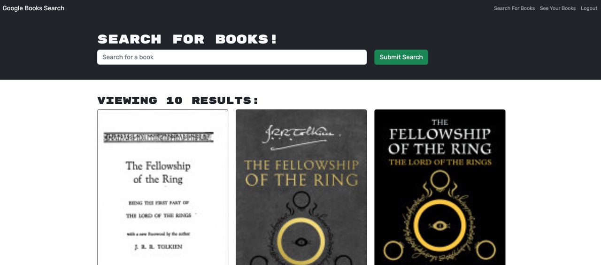
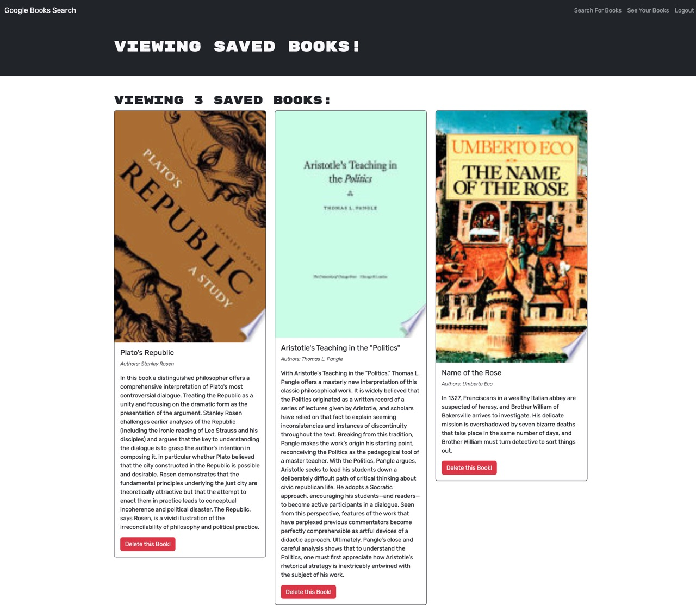

# Book Search Engine

[](https://opensource.org/licenses/ISC)

## Description

It's hard being a voracious reader and not knowing what to read next. The stuff that nightmares are made of. Truly. 

This MERN stack web application aims to solve this issue by allowing users to search for books and save them in their user accounts. 

A more elegant solution than having an ever expanding pile of unread books consume every square inch of real estate in one's home.

Speaking of voracious readers; this project was inspired by reading 'the docs' of GraphQL. A preëxisting MERN stack using RESTful APIs was refactored to use GraphQL APIs. Please refer to the [Credits](#credits) section for more details.

[Deployed web application](https://mqas1-booksearch.herokuapp.com/).
  
## Table of Contents
  
- [Description](#description)
- [Installation](#installation)
- [Usage](#usage)
- [Credits](#credits)
- [License](#license)
- [Contributing](#contributing)
  
## Installation

From the command line run the following command, ```npm i```, to install the required packages for both the client and server. 

Then use ```npm run develop``` to start the application.

## Usage



The user can search for books without creating an account but will not be able to see the save button unless they are logged in.

Once logged in or after creating an account the user will then see buttons with the text ```"Save this Book!"``` at the bottom of each book card. If a book is saved the button text changes to  ```"This book has already been saved!"```.

To see their saved book list the user clicks on the link ```"See Your Books"``` in the navigation. 



Having navigated to their saved page the user can delete any book from the page with the ```"Delete this Book!"``` button.

Not all books can be saved. The database requires a "description" field. As such, any book card without a description will not be saved.

## Credits
Codebase using RESTful APIs by [edX](https://techbootcamp.sydney.edu.au/coding/) can be found [here](https://github.com/coding-boot-camp/solid-broccoli). This was refactored to use GraphQL APIs by [Morgan Qasabian](https://github.com/mqas1). 
  
## License
This application is covered under the [ISC License](https://opensource.org/licenses/ISC):
        
        Copyright 2023 edX/mqas1

        Permission to use, copy, modify, and/or distribute this software for any purpose with or without fee is hereby granted, provided that the above copyright notice and this permission notice appear in all copies.

        THE SOFTWARE IS PROVIDED "AS IS" AND THE AUTHOR DISCLAIMS ALL WARRANTIES WITH REGARD TO THIS SOFTWARE INCLUDING ALL IMPLIED WARRANTIES OF MERCHANTABILITY AND FITNESS. IN NO EVENT SHALL THE AUTHOR BE LIABLE FOR ANY SPECIAL, DIRECT, INDIRECT, OR CONSEQUENTIAL DAMAGES OR ANY DAMAGES WHATSOEVER RESULTING FROM LOSS OF USE, DATA OR PROFITS, WHETHER IN AN ACTION OF CONTRACT, NEGLIGENCE OR OTHER TORTIOUS ACTION, ARISING OUT OF OR IN CONNECTION WITH THE USE OR PERFORMANCE OF THIS SOFTWARE.
         
## Contributing
  
The guidelines for contributing to this application can be found at the [Contributor Covenant](https://www.contributor-covenant.org/).

---
  
*This README was made with ❤️ by the [README Generator](https://github.com/mqas1/readme-generator)*